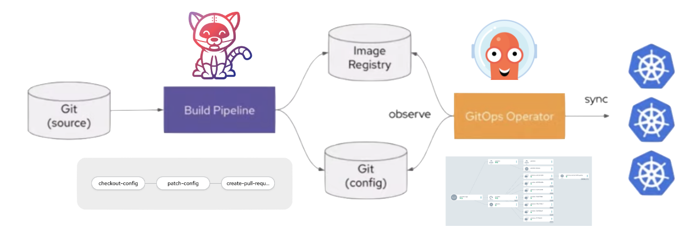

## ☘️ pb-ci-cd ☘️

Tekton pipelines for the Pet Battle suite of applications.

If you want to learn how to create this project read [DEVELOPMENT.md](DEVELOPMENT.md)

We use a Pull Model of deployment - Tekton for the CI pipeline, and ArgoCD to deploy changes using GitOps.


### 🤠 For the impatient 🤠

Just run this code as a cluster admin user:
```bash
# clone this repo and
cd ubiquitous-journey
# bootstrap to install argocd and create projects
helm template bootstrap --dependency-update -f bootstrap/values-bootstrap.yaml bootstrap | oc apply -f-
# create the argocd token secret in labs-ci-cd namespace see TBD below
# give me ALL THE TOOLS, EXTRAS & OPSY THINGS !
helm template -f argo-app-of-apps.yaml ubiquitous-journey/ | oc -n labs-ci-cd apply -f-
# start a pipeline run
oc -n labs-ci-cd process pet-battle-api | oc -n labs-ci-cd create -f-
oc -n labs-ci-cd process pet-battle | oc -n labs-ci-cd create -f-
oc -n labs-ci-cd process pet-battle-tournament | oc -n labs-ci-cd create -f-
```

If you have already built and tagged images, you can redeploy the argocd application suite (helm template) using:
```bash
oc -n labs-ci-cd process pet-battle-api-deploy | oc -n labs-ci-cd create -f-
oc -n labs-ci-cd process pet-battle-deploy | oc -n labs-ci-cd create -f-
oc -n labs-ci-cd process pet-battle-tournament-deploy | oc -n labs-ci-cd create -f-
```

If you are on a branch, you can test a development deployment (helm update --install) using:
```bash
# GIT_BRANCH=release_name, GIT_SHORT_REVISION=image_version, HELM_CHART_VERSION is Optional (it will pull latest chart from nexus helm chart repo if not specified)
oc -n labs-ci-cd process pet-battle-api-deploy -p GIT_SHORT_REVISION=latest -p GIT_BRANCH=my -p HELM_CHART_VERSION=1.0.6 | oc -n labs-ci-cd create -f-
oc -n labs-ci-cd process pet-battle-api-deploy -p GIT_SHORT_REVISION=latest -p GIT_BRANCH=develop | oc -n labs-ci-cd create -f-
```

To create webhooks in github repos run these (TaskRuns) once manually
```bash
oc -n labs-ci-cd process create-webhook -p GITHUB_ORG=eformat -p GITHUB_REPO=pet-battle-api -p WEBHOOK_URL=http://$(oc -n labs-ci-cd get route webhook -o custom-columns=ROUTE:.spec.host --no-headers) | oc -n labs-ci-cd create -f-
oc -n labs-ci-cd process create-webhook -p GITHUB_ORG=eformat -p GITHUB_REPO=pet-battle -p WEBHOOK_URL=http://$(oc -n labs-ci-cd get route webhook -o custom-columns=ROUTE:.spec.host --no-headers) | oc -n labs-ci-cd create -f-
oc -n labs-ci-cd process create-webhook -p GITHUB_ORG=petbattle -p GITHUB_REPO=tournamentservice-v1 -p WEBHOOK_URL=http://$(oc -n labs-ci-cd get route webhook -o custom-columns=ROUTE:.spec.host --no-headers) | oc -n labs-ci-cd create -f-
```

## To Be Done
- [ ] make secrets handling more realistic - use sealed secrets or hashicorp vault - https://www.openshift.com/blog/integrating-hashicorp-vault-in-openshift-4, quarkus hashicorp integration - https://quarkus.io/guides/vault

```bash
# manually mount secrets for now
oc -n labs-ci-cd apply -f ~/tmp/git-auth.yaml

# generate argocd cd token
oc -n labs-ci-cd patch cm argocd-cm --type='json' -p='[{"op": "add", "path": "/data", "value": {"accounts.admin": "apiKey"}}]'
HOST=$(oc -n labs-ci-cd get route argocd-server --template='{{ .spec.host }}')
argocd login $HOST:443 --sso --insecure --username admin
TOKEN=$(argocd account generate-token --account admin | base64 -w0)
sed -i -e "s|  password:.*|  password: ${TOKEN}|" ~/tmp/argocd-token.yaml
oc -n labs-ci-cd apply -f ~/tmp/argocd-token.yaml
```

- [ ] delete deprecated tekton conditionals once pipeline operator updated -> when syntax

```yaml
    - name: oc-tag-image-test
      when:
        - input: "$(params.GIT_BRANCH)"
          operator: in
          values: ["main"]

    - name: helm-argocd-apps-branches # only deploy to dev, fullname includes branch
      when:
        - input: "$(params.GIT_BRANCH)"
          operator: notin
          values: ["main"]
```

- [X] Operator split into charts requiring privilege
- [ ] tekton-tidy.sh, clean artifacts in workspace, add to UJ day2
- [ ] ubi quarkus ubi build image with tools, check base now we have new images (using custom one)
- [ ] code quality gates - configure pipeline args to fail on quality gates
- [X] document webhook triggers create them using tekton task
- [ ] dev-ex-dashboard configure - REPLACE this with Console Links Chart when ready!! https://github.com/redhat-cop/helm-charts/pull/109
- [ ] add nsfw apps to this guide
- [X] add github triggers work
- [X] split test, stage deploys - app of apps
